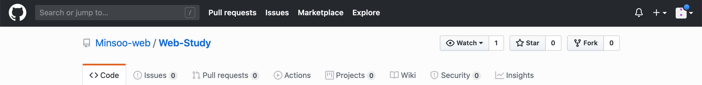
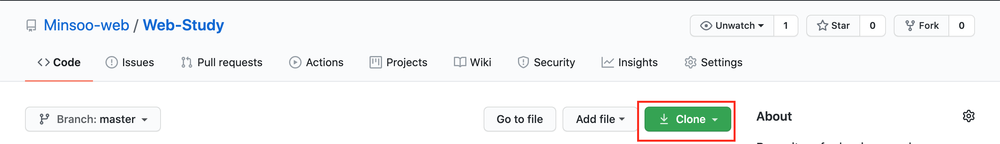
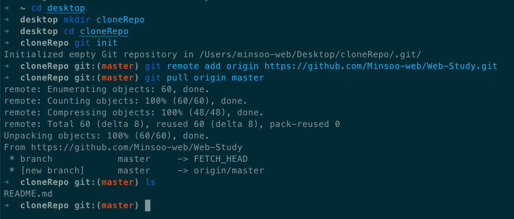
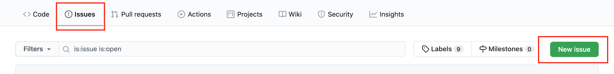

# 웹 프로그래밍 스터디 - Publisher

이 저장소는 퍼블리싱 기초 스터디 실습 레포지토리입니다.

## Our Goal

프로젝트를 진행하며 역할에따라 브랜치를 나누어
각 파트별로 분업하여 하나의 웹 페이지를 같이 만들어갈 계획입니다.

### Github & git docs

#### How to fork



레포지토리 페이지 우측 상단에 보이는 `Fork` 버튼을 클릭합니다.  
약간의 시간이 지난 뒤 본인의 계정에 fork된 레포지토리가 생성된 것을 확인할 수 있습니다.

#### How to Clone

> 컴퓨터에 git이 설치가 되어있어야 합니다!



포크된 repository 상단에 보이는 초록색 Clone이라는 버튼을 누르면 나오는 URL을 복사합니다.

`https://github.com/<>/Web-Study.git`

터미널을 엽니다. (window는 git bash 또는 powershell)



순서대로 입력합니다.

```bash
cd desktop # 바탕화면으로 이동
mkdir cloneRepo # 'cloneRepo'라는 이름의 폴더를 생성 (폴더 이름은 자유)
cd cloneRepo # 방금 만든 폴더로 이동 (방금 만든 폴더 이름을 적어주시면 됩니다.)
git init # git local repository 로 만들어줍니다.
git remote add origin https://github.com/Minsoo-web/Web-Study.git
git pull origin master
```

바탕화면에 저희가 만든 폴더와 제 레포지토리의 내용이 그대로 옮겨진 것을 볼 수 있을 겁니다.

#### How to checkcout branch

터미널을 열고 만드신 로컬 프로젝트 폴더로 이동합니다.

순서대로 입력합니다.

```bash
git pull origin <study-branch> # publisher의 경우 git pull origin publisher
git checkout <study-branch> # checkout to branch
```

#### How to regist issue on this repo



레포지토리 페이지 상단의 `issue` 탭에서 `New issue`를 클릭  
자유로운 질문 및 의견 남겨주시면 되겠습니다.

## Study List

1. HTML / CSS

2. JS

## Clone Project

원본 페이지 :

## Contributors & Contact

김민수 : _Minsoo Kim_  
[https://github.com/Minsoo-web](https://github.com/Minsoo-web)

## Update Log

### Publisher branch

- 브랜치 생성 및 README 수정
